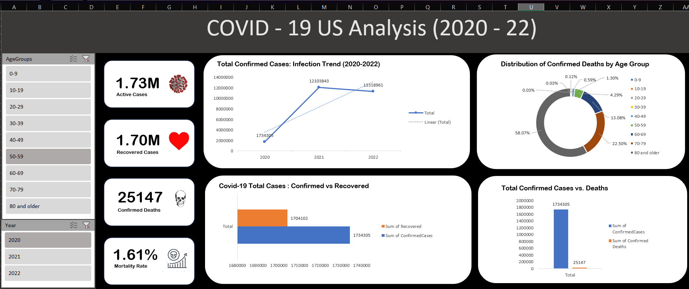

# COVID---19-US-Analysis-2020---22-
Interactive Excel Dashboard analyzing COVID-19 cases in the US (2020–2022) with insights on infection trends, recoveries, mortality, and age-group impacts.

# 🦠 COVID-19 US Dashboard (2020–2022)

📊 An interactive **Excel Dashboard** analyzing COVID-19 cases in the United States from **2020–2022**.  
The dashboard highlights **infection trends, recovery, mortality rate, and age-group impacts**.  

---

## 🔍 Features
- ✅ Total confirmed, recovered, active cases, and deaths  
- ✅ Mortality rate calculation  
- ✅ Infection trend analysis (2020–2022)  
- ✅ Distribution of deaths by age group  
- ✅ Comparison of confirmed vs recovered cases  
- ✅ Interactive slicers (filter by **Year** & **Age Group**)  

---

## 📸 Dashboard Preview

---

## ⚙️ Tools Used
- **Microsoft Excel** → Pivot Tables, Charts, Slicers, Conditional Formatting, KPI Cards  

---

## 📂 Repository Structure

---

## 📈 Key Insights
- Cases grew rapidly and **peaked in 2021**.  
- **80+ age group** accounted for the majority of deaths (**58%**).  
- Overall mortality rate: **1.61%**.  
- Recovery rate remained consistently **high across all years**.  

---

## 🚀 How to Use
1. Download the `COVID19_US_Dashboard.xlsx` file from the `dashboard/` folder.  
2. Open it in **Microsoft Excel**.  
3. Use the slicers (Year & Age Group) to filter the data dynamically.  

---

## 👨‍💻 Author
Created by **[Your Name]** ✨  
2nd Year B.Tech CSE | Data Science Enthusiast  

---

⭐ If you like this project, don’t forget to **star this repo**!

